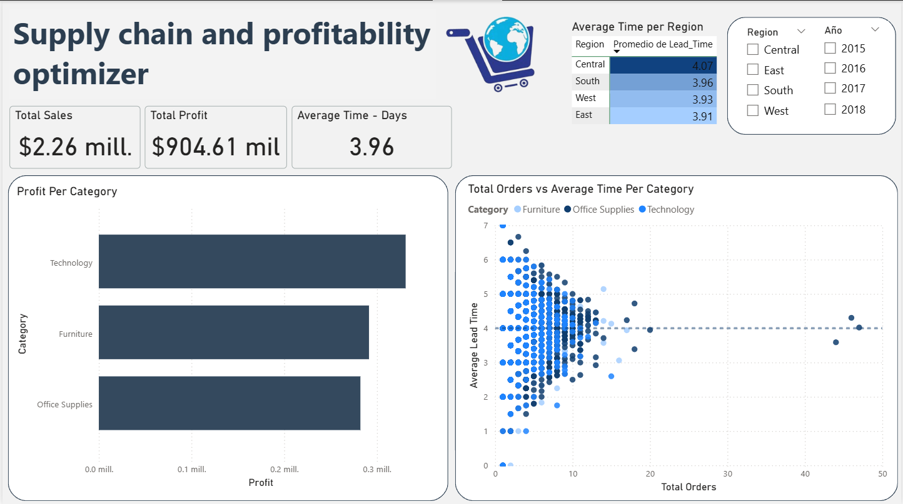

# 📊 Strategic Inventory & Sales Performance Dashboard

## 📌 Executive Summary
This project presents a comprehensive analysis of sales and logistics for a major retail chain. By integrating sales data with supply chain metrics, I developed a decision-making tool that identifies **revenue optimization opportunities** and **logistics bottlenecks**. The dashboard highlights a critical "4-day lead time barrier" and identifies categories with sub-optimal profitability.

## 💼 Business Case
In a competitive retail environment, stagnant inventory and slow deliveries lead to customer dissatisfaction and lost capital. 
* **The Problem:** The company lacked visibility into which products were "stuck" in the supply chain and which categories were truly driving net profit.
* **The Goal:** Create a high-level executive report to monitor KPIs, evaluate regional logistics performance, and mitigate stockout risks.

## 📉 Data Insights & Business Intelligence
### 1. The "4-Day Lead Time" Bottleneck
Analysis revealed that most products, regardless of demand, face a rigid **4-day delivery cycle**. This lack of a "Fast-Track" strategy for high-volume items increases the risk of stockouts for top-selling products.

### 2. Profitability vs. Volume (The Furniture Gap)
While **Office Supplies** and **Technology** categories show healthy margins, the **Furniture** category contributes only **6.3% to the total net profit** despite its significant storage requirements. 
* *Recommendation:* Review the supply chain costs or pricing strategy for the Furniture segment.

### 3. Supply Chain Risk Modeling
Using a **Scatter Plot (Orders vs. Lead Time)**, I identified products in the "Crisis Zone" (High demand + High delivery time). These items are the primary targets for inventory optimization to prevent revenue leakage.

*Figure 1: Main Executive Dashboard showing KPIs, Regional Performance, and Risk Analysis.*

## 🛠️ Tech Stack & Methodology
- **SQL (Logic):** Modeled data relationships using JOINs and calculated fields for profitability and delivery efficiency.
- **Power BI:** Developed the interactive dashboard, utilizing **DAX** for advanced metrics like Average Lead Time and Total Profit.
- **Data UI/UX:** Applied professional design principles (Card-based layout, color hierarchy) to improve executive readability.

## 🏁 Key Deliverables
- **Interactive Slicers:** Filter by Region, Category, and Time for granular analysis.
- **Logistics Heatmap:** Visual identification of underperforming shipping zones.
- **Profitability Audit:** Cross-category comparison to guide inventory investment.

---
**Contact:** **Helian Fierro** | [LinkedIn Profile](https://www.linkedin.com/in/helian-fierro-oyola-143798206/)
